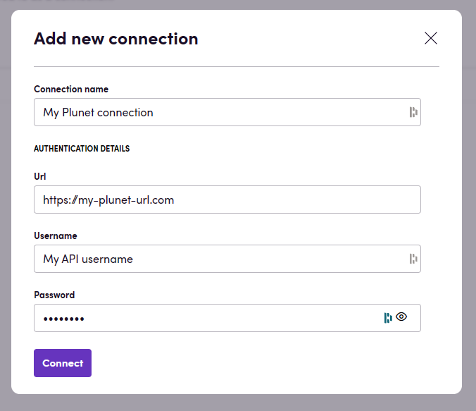
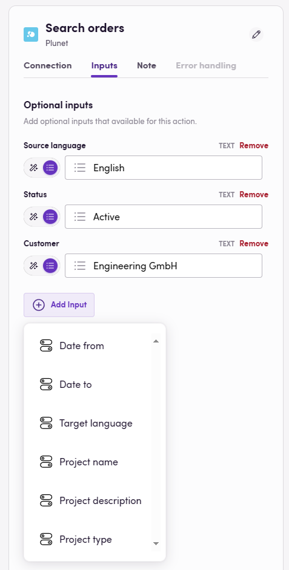
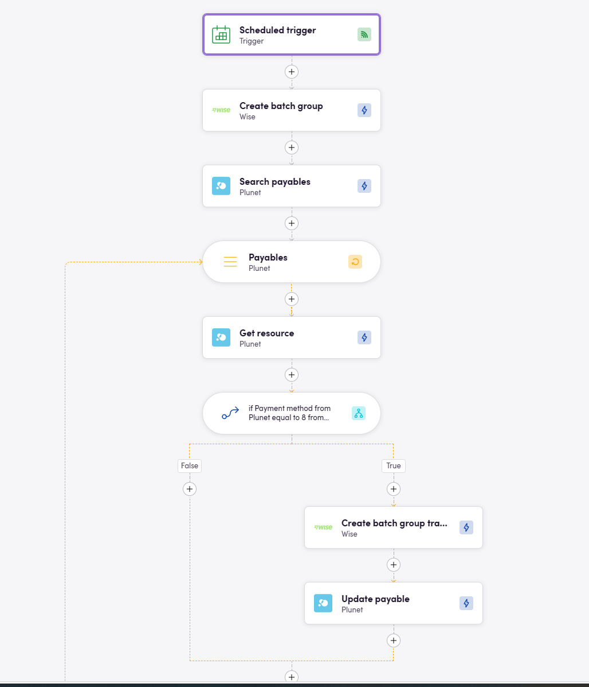

# Blackbird.io Plunet

Blackbird is the new automation backbone for the language technology industry. Blackbird provides enterprise-scale automation and orchestration with a simple no-code/low-code platform. Blackbird enables ambitious organizations to identify, vet and automate as many processes as possible. Not just localization workflows, but any business and IT process. This repository represents an application that is deployable on Blackbird and usable inside the workflow editor.

## Introduction

<!-- begin docs -->

Plunet is a translation business management software solution. Its features include the creation of quotes, orders, assigning resources to jobs and invoicing. This Plunet app allows you to automate many of the labor-intensive tasks.

## Before setting up

Before you can connect you need to make sure that:

- You have a Plunet instance and have sufficient admin rights on this instance.
- You have a Plunet API user created.

## Connecting

1. Navigate to Apps, and identify the **Plunet** app. You can use search to find it.
2. Click _Add Connection_.
3. Name your connection for future reference e.g. 'My Plunet connection'.
4. Fill in the URL to the Plunet instance you want to connect to. You can usually copy this part of the URL when you are logged into your Plunet instance.
5. Fill in the username of your Plunet API user.
6. Fill in the password of your Plunet API user.
7. Click _Connect_.

### Troubleshooting

If you are unable to connect, please check the following:
1. The URL should look like `https://plunet-friend.plunet.com`. Without /PlunetAPI at the end.
2. You must sure that your URL is accessible from the our servers. To check this, you can try to open the URL with '/PlunetAPI?wsdl' at the end in your browser (you should see an XML document that describes the API).
3. Ensure that you don't have firewall rules that block the connection or whitelist of IP addresses that are allowed to connect to your Plunet instance (or if you do, make sure to whitelist the Blackbird IP addresses).

## Actions

### Contacts

- **Get customer contacts** Lists all the contacts related to a customer
- **Get contact** returns the contact's details
- **Get contact by external ID** finds the contact given the external ID field
- **Create contact** creates a new customer contact
- **Update contact** updates an existing customer contact

### Customers

- **Search customers** returns a list of customers based on numerous optional search parameters including:
  - Customer type
  - Email
  - Source language
  - Name 1 & Name 2
  - Status
- **Get customer**
- **Delete customer**
- **Create customer**
- **Update customer**

### Documents

- **Upload file** uploads a file to a specific folder of any entity that can have files attached to it
- **Download file** can download a file of any entity that can have files attached to it
- **Download all files in folder**
- **Calculate word count** calculate the word count of documents. Only text files such as .txt, .html, .xliff, .docx and .pdf are supported.

### Items

- **Search items** returns a list of items based on the following criteria, optionally the returned currency can be set as well:
  - Order or quote iD
  - Item status
  - Document status
- **Find item**
- **Get language independet item**
- **Get item**
- **Create item**
- **Delete item**
- **Update item**
- **Get item pricelines** returns all the pricelines attached to this item
- **Create item priceline** Creates a new priceline entry for this item
- **Delete item priceline** Deletes a priceline from an item
- **Update item priceline** Updates a priceline on an item
- **Find price unit** Given a service and a price unit description, the first matching price unit item is returned
- **Copy jobs from workflow** Copy jobs from the selected workflow into the specified item

Note that when creating/updating items, the source and target languages can be set (they must either both be provided or not). Blackbird will assign the correct existing language combination to the item or, if the language combination doesn't exist, the language combination will be created first on the order or quote.

### Jobs

- **Get item jobs** returns a list of jobs attached to a certain item
- **Get job**
- **Create job**
- **Delete job**
- **Update job**
- **Get job pricelines**
- **Create job priceline**
- **Delete job priceline**
- **Update job priceline**

### Orders

- **Search orders** returns a list of orders based on numerous optional search parameters including:
  - Date from
  - Date to
  - Source language
  - Target language
  - Status
  - Customer ID
  - Name
  - Description
  - Type
- **Get order**
- **Create order**
- **Delete order**
- **Update order**
- **Add language combination to order**

An example of the granularity at which orders (and other entities) can be selected.

### Payables

- **Search payables** returns a list of payables based on numerous optional search parameters including:
- **Get payable**
- **Export payable** exports a payable to a JSON format that can be used in other apps.
- **Update payable**

### Quotes

- **Search quotes** returns a list of quotes based on numerous optional search parameters including:
  - Date from
  - Date to
  - Date refers to (invoice date, value date, due date, paid date)
  - Exported
  - Status
  - Currency
  - Resource ID
- **Get quote**
- **Get quote item target languages for source**
- **Create quote**
- **Delete quote**
- **Update order**
- **Add quote combination to quote**

### Requests

- **Search requests** returns a list of requests based on numerous optional search parameters including:
  - Date from
  - Date to
  - Source language
  - Target language
  - Status
  - Customer type
  - Customer ID
- **Get request**
- **Create request**
- **Delete request**
- **Update request**
- **Add language combination to request**
- **Create quote from request**
- **Create order from request**

### Resources

- **Search resources** returns a list of resources based on numerous optional search parameters including:
  - Contact ID
  - Resource type
  - Email
  - Name 1 & Name 2
  - Status
  - Source language
  - Target language
  - Working status
- **Get resource** Get details of a specific resource
- **Find resource** Find a specific resource based on specific criteria
- **Find resource by text module** Find resources by text module
- **Update resource** Update a specific resource with new details
- **Assign resource to job** assigns a resource to a job
- **Create resource** create a new empty resource dataset

### Custom properties

- **Set property**
- **Get property**
- **Set text module value** sets the value of a text module if it represents a single value
- **Get text module value** gets the value of a text module, if the text module represents multiple values it will return the first one. 
- **Get multiple text module values** returns a list of values. Works if the text module represents multiple values.
- **Set multiple text module values** sets the list of values of the text module if it represents multiple values.

Note that with text modules you need to specify the Plunet _Flag_ which can be found by going to Admin > Document templates > Text modules. Flags typically are created between [square brackets]

## Search limitations

The search actions have a limit of 50 results. If you need to search for more results, you can use the `Limit` optional parameter to increase the limit.

We set this limit to prevent issues that can arise from executing multiple parallel actions simultaneously. When several search actions are run at the same time, it puts a significant load on the Plunet API. This can cause timeouts and failures, especially when dealing with a large number of results. By limiting the number of results returned in each search action, we help ensure more stable and reliable performance of the Plunet API.

## Events

All webhooks return all data for the entity they were invoked on. All _status changed_ events have an optional input field _new status_ which can be used to differentiate the new status after the event.

### Customers

- **On customer deleted**
- **On customer created**
- **On customer status changed**

### Items

- **On item deleted**
- **On item created**
- **On item status changed**
- **On item delivery date changed**

### Jobs

- **On job deleted**
- **On job created**
- **On job status changed**
- **On job delivery date changed**
- **On job start date changed**

### Orders

- **On order deleted**
- **On order created**
- **On order status changed**

### Quotes

- **On quote deleted**
- **On quote created**
- **On quote status changed**

### Requests

- **On request deleted**
- **On request created**
- **On request status changed**

### Resources

- **On resource deleted**
- **On resource created**
- **On resource status changed**

### Payables

- **On payable created**

## Example

The following example shows how a bird can be setup that creates a new Wise batch transfer for all payables that are set to ready for payment and where the resources are on the Wise platform. An acompanying bird would update the payable status when the payment has succesfully been made in Wise.

## Top Use-Cases

1. **Synchronize Plunet and CRM data** - Blackbird supports CRM platforms like HubSpot, Notion, Salesforce, and Pipedrive.
2. **Create Plunet orders from incoming TMS tasks with bucketing-batching** - We support systems such as Bureau Works, Lokalise, Crowdin, Phrase, Smartling, XTM, and many more.
3. **Integrate CAT tools with Plunet (Bidirectional integration)**.
4. **Pay vendors with Wise** - Plunet-Wise payment integration.
5. **Integrate with QuickBooks Online**.
6. **Integrate with Outlook, Gmail, Teams, and Slack** for better communication.
7. **Sync data with BI tools**.
8. **Plunet - Remote.com integration** - Synchronize key data between Plunet and Remote.

Want to learn more? [Book a demo](https://www.blackbird.io/)

## Missing features

Are you missing a particular feature? Let us know!

## Feedback

Do you want to use this app or do you have feedback on our implementation? Reach out to us using the [established channels](https://www.blackbird.io/) or create an issue.

<!-- end docs -->
